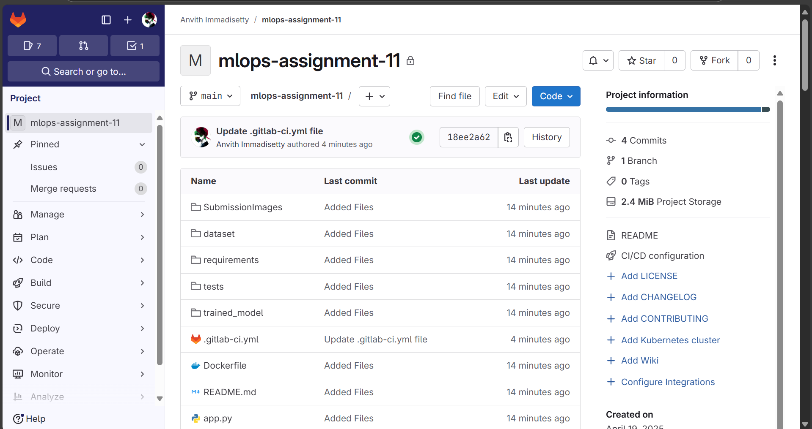
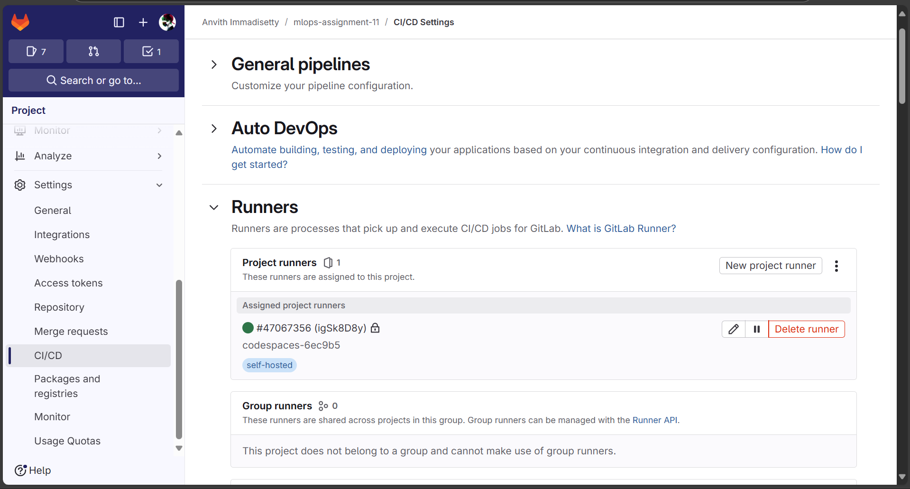
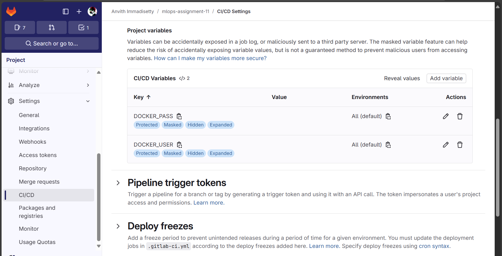
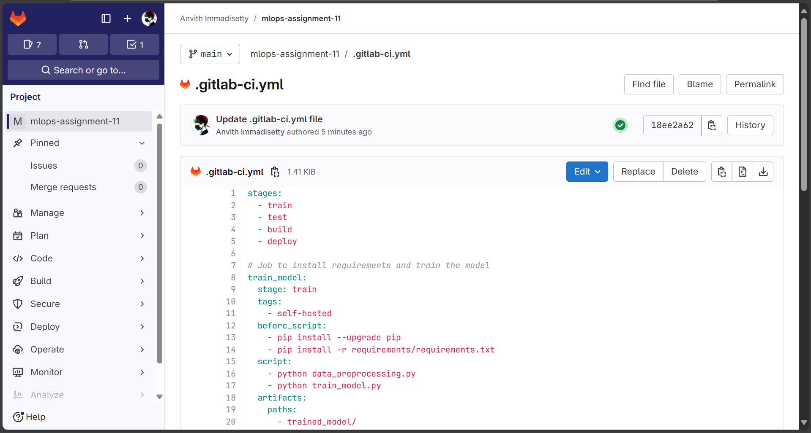
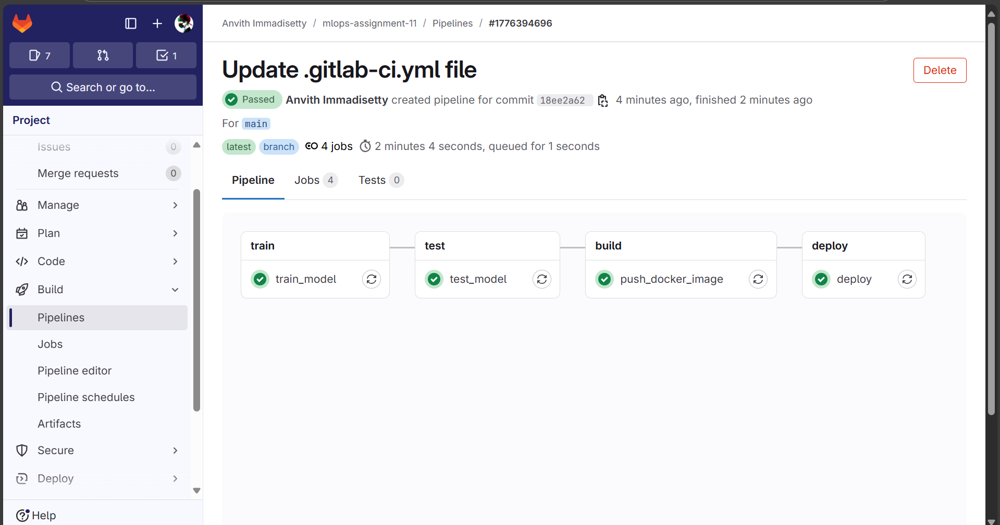
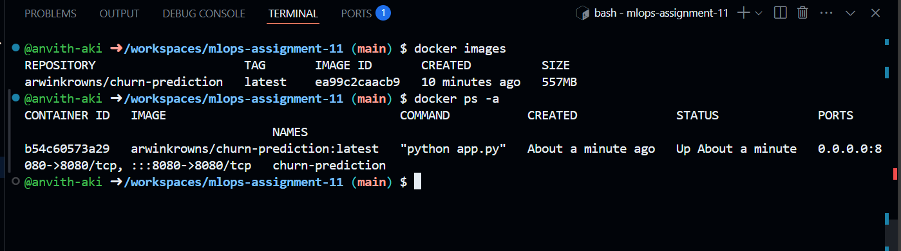
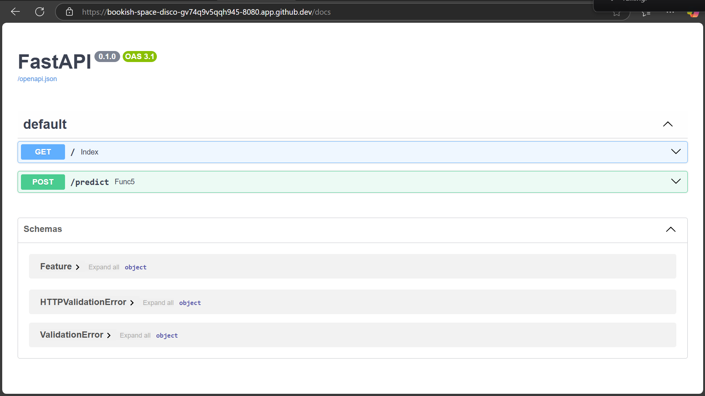
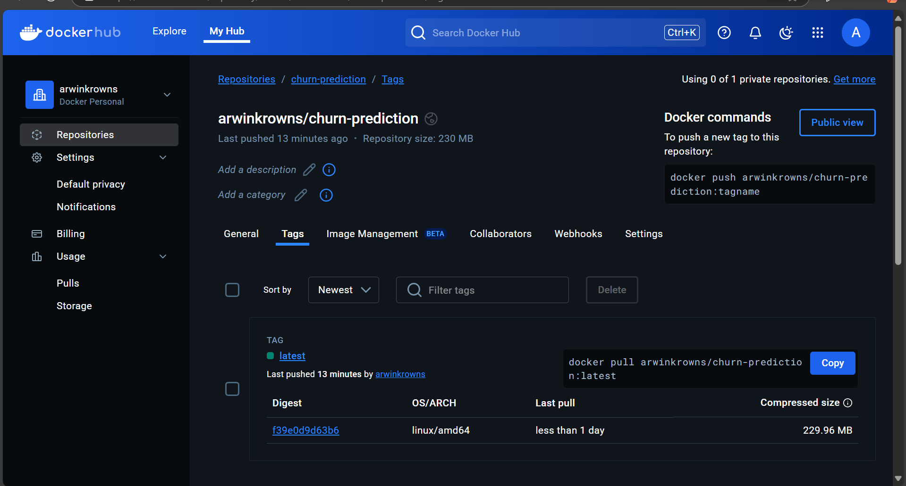

# Output Documentation

Below are the outputs documented with corresponding images:

## Images

### GitLab Repository

### GitLab Custom Runner

### GitLab Vars

### .gitlab-ci.yml

### Pipeline Run Status

### Running Container in codespace

### Final WEB UI

### Docker Hub

